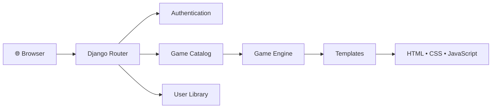
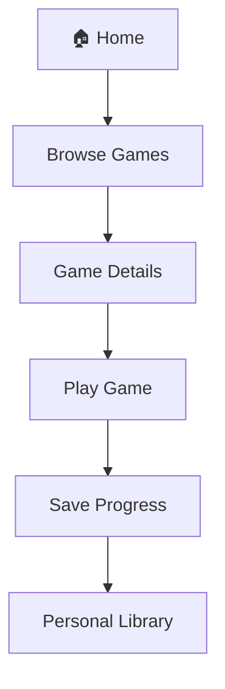
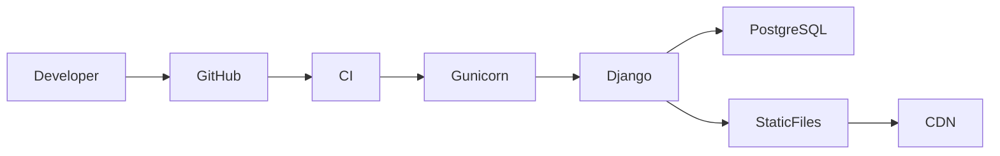
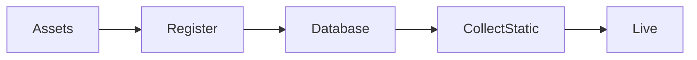

<p align="center">
  
</p>

<h1 align="center">Obsidian Game Club</h1>

<p align="center">
A premium browser gaming platform built with Django, delivering a modern Apple inspired experience through elegant design, seamless gameplay, and scalable architecture.
</p>

<p align="center">

[](https://github.com/hassanireza/obsidianGameClub/actions/workflows/ci.yml)


</p>

---

# Overview

Obsidian Game Club is a modern web platform designed for discovering and playing browser based games through a polished and immersive interface. Built on Django, the platform combines elegant UI, scalable architecture, and maintainable code to provide a premium gaming experience for both players and developers.

---

# Features

- Premium Apple inspired interface
- Browser based gameplay
- Responsive design
- User authentication
- Personal game library
- Wishlist management
- Dynamic game catalog
- Django administration panel
- Easily expandable architecture
- Production ready structure

---

# Architecture



---

# User Flow



---

# Technology Stack

| Layer | Technology |
|--------|------------|
| Backend | Django |
| Language | Python |
| Frontend | HTML5 |
| Styling | CSS3 |
| Scripting | JavaScript |
| Development | TypeScript |
| Database | SQLite / PostgreSQL |
| Templates | Django Templates |

---

# Project Structure

```text
obsidian_game_club/
│
├── accounts/
├── games/
├── templates/
├── static/
│   ├── css/
│   ├── js/
│   ├── ts/
│   ├── images/
│   └── icons/
├── fixtures/
├── media/
├── config/
├── manage.py
└── requirements.txt
```

---

# Installation

Clone the repository

```bash
git clone https://github.com/yourusername/obsidian_game_club.git
```

Install dependencies

```bash
pip install -r requirements.txt
```

Run migrations

```bash
python manage.py migrate
```

Create an administrator

```bash
python manage.py createsuperuser
```

Start the development server

```bash
python manage.py runserver
```

---

# Deployment



---

# Adding New Games



1. Add the game assets.
2. Register the game in Django.
3. Upload thumbnails and banners.
4. Collect static files.
5. Launch instantly across the platform.

---

# Production Checklist

- HTTPS enabled
- Environment variables configured
- `DEBUG=False`
- PostgreSQL configured
- Static assets collected
- Media storage configured
- Secure authentication
- Logging enabled
- Scheduled backups

---

# Roadmap

- Multiplayer support
- Achievements
- Leaderboards
- Cloud saves
- User reviews
- Progressive Web App
- Analytics dashboard
- Friends system

---

# License

Distributed under the MIT License.

---

<p align="center">

**Crafted for premium browser gaming experiences.**

Designed with scalability, maintainability, and exceptional user experience at its core.

</p>
